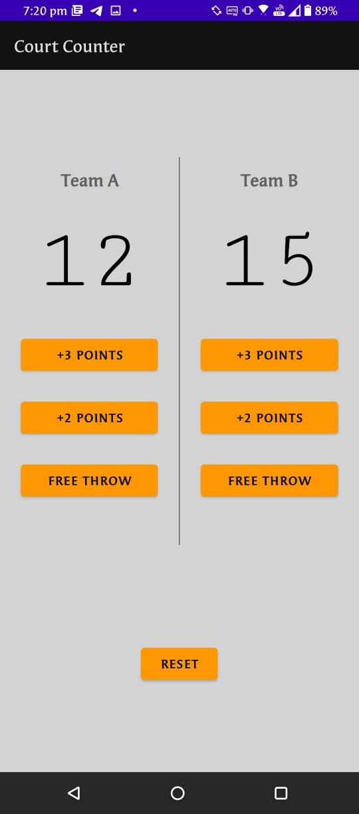
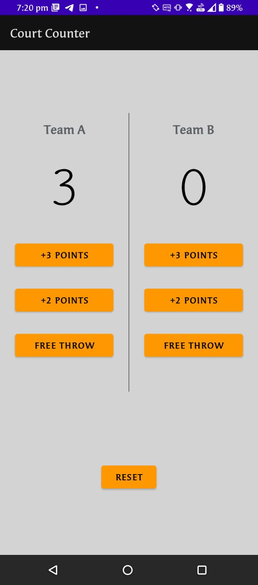
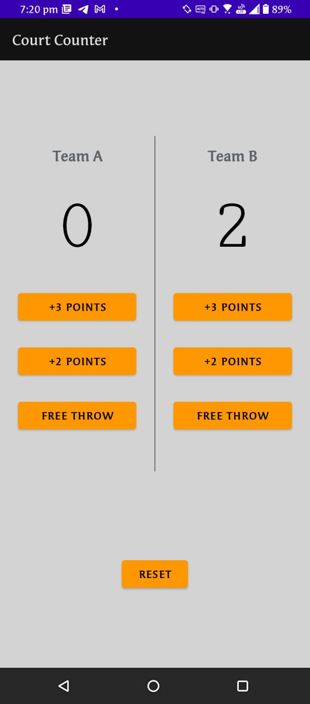
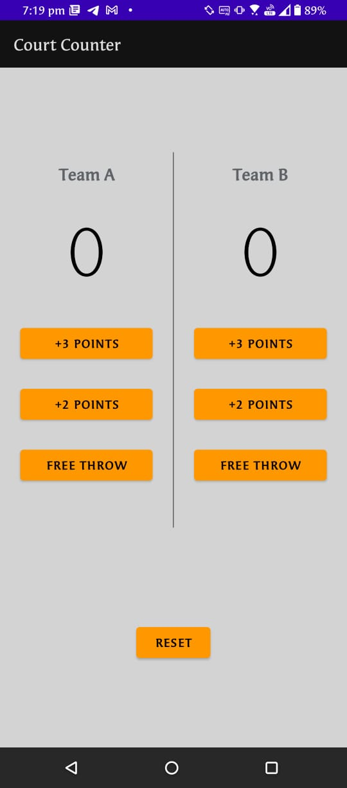

# CourtCounter
Basket Ball score tracking app.

1. This app is used to keep track of current scores of both the teams during a basket ball match. It follows the general scoring rules of basket ball.

2.  If we press the +3 POINTS button it increases the score by 3.

3.  If we press the +2 POINTS button it increases the score by 2.

4. If we press the FREE THROW button it increases the score by 1.

5. And finally if we press on the RESET button then it resets both the scores to 0.

